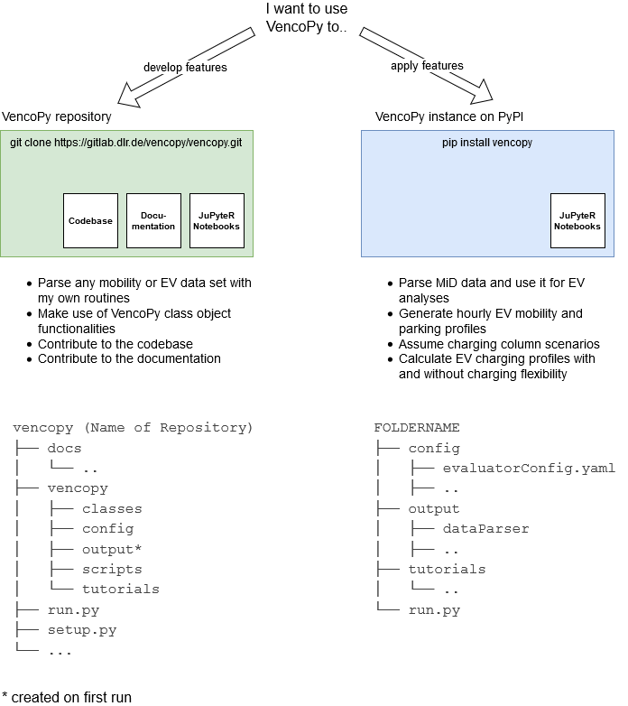

.. venco.py installation documentation file, created on February 11, 2020
    by Niklas Wulff
    Licensed under CC BY 4.0: https://creativecommons.org/licenses/by/4.0/deed.en

.. _installation:

Installation and Setup
===================================

Requirements and boundary conditions
-------------------------------------

venco.py runs on Unix and Windows-based operating systems. It requires an installed version of python and the package, dependency and environment management tool conda as well as access to the internet for setting up the environment (downloading the required packages).
Versioning is based on major, minor and fix (X.Y.Z) changes versioning system via git-labels. You can use venco.py as a user or contribute to the codebase and documentation as developer. Depending on that choice the installation and setup differs.

Installation for users
-------------------------------------
As a user, you will apply venco.py for answering analytical questions. Thus, you're mainly interested in applying venco.py's built-in features and functions. On this level, you will not change the codebase within the venco.py class objects - of course you can write your own data processing routines around those functions.

Install using the environment management system conda, open the conda console, create a new environment and activate it by typing::

	conda create -n <your environment name> python=3.9
	conda activate <your environment name>

Install venco.py from the Python Package Index PyPI::

	pip install vencopy

Navigate to a parent directory where you want to create your venco.py user folder in and type::

	vencopy

You will be prompted for a userfolder name, type it and hit enter. Your venco.py user folder will now be created. It
will look like this:

::

    FOLDERNAME
    ├── config
    │   ├── dev_config.yaml
    │   └── user_config.yaml
    ├── output
    │   ├── dataparser
    │   │   ├── dataparsers
    │   │   ├── parkinference
    │   │   ├── parseMiD
    │   │   └── parseKiD
    │   ├── gridmodeler
    │   ├── flexestimator
    │   ├── diarybuilder
    │   ├── profileaggregator
    │   └── postprocessor
    ├── tutorials
    │   └── ..
    └── run.py

The configs in the config folder are the main interface between the user and the code. In order to learn more about
them, check out our tutorials. For this you won't need any additional data.

To run venco.py in full mode, you will need the data set Mobilität in Deutschland (German for mobility in Germany), you
can request it here from the clearingboard transport: https://daten.clearingstelle-verkehr.de/order-form.html Currently,
venco.py is only tested with the B2 data set.

In your user_config.yaml, please enter the path to your local MiD STATA folder, it will end on .../B2/STATA/. Now
open your user folder in an IDE, configure your interpreter (environment) or type::

	python run.py

Installation for developers
-------------------------------------

This part of the documentation holds a step-by-step installation guide for venco.py.

1.  Navigate to a folder to which you want to clone venco.py. Clone the repository to your local machine using ::

        git clone https://gitlab.com/dlr-ve/vencopy/vencopy.git

2.  Set-up your environment. For this, open a conda console, navigate to the folder of your venco.py repo and
    enter the following command::

        conda env create -f requirements.yml
        conda activate vencopy

3.  Configure your config files if you want to use absolute links. This is only needed if you want to reference your own
    local data or want to post-process venco.py results and write them to a model input folder somewhere on your drive.
    You will find your config file in your repo under /config/config.yaml Input filenames are set to the example files
    shipped with the repo. You may specify labels for file naming in the config under the key "labels".

4.  You're now ready to run venco.py for the first time by typing::

        python run.py

5.  Have fun calculating electric vehicles flexibility!

