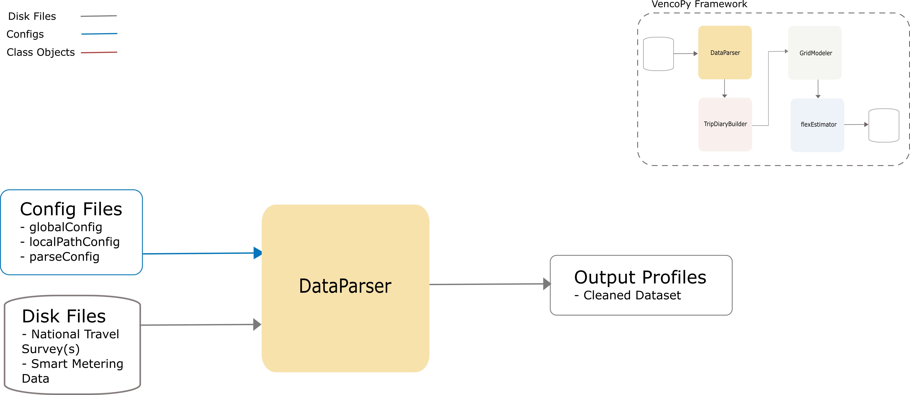

.. VencoPy documentation source file, created for sphinx

.. _dataParser:

DataParser Class
===================================

DataParser Input
---------------------------------------------------
**Config File (parseConfig.yaml):**

* dataVariables (selects the variables from the original dataset)
* IDVariablesNames (selects the name of unique identifiers of the vehicle/person carrying out the trip)
* inputDTypes (specifies the data type of the data variables)
* filterDicts (assigns values to the filters, which include inclusion, exclusion and equality relationships)
* Replacements (replaces numeric variables with more explicita variables)

**Disk Files: (dataset with mobility patterns)**

* National travel surveys
* Mobility patterns from traffic models

DataParser Output
---------------------------------------------------
**Output Functions:**

*  vpData = ParseMiD(configs=configs, dataset=dataset)
*  vpData.process()