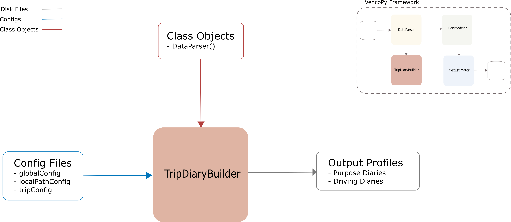

.. venco.py documentation source file, created for sphinx

.. _diarybuilder:

DiaryBuilder Class
===================================

TripDiaryBuilder Input
---------------------------------------------------
**Config File (user_config.yaml):**

* time_resolution: <value> - User-specific time resolution in minutes
* is_week_diary: bool - Determine if the activity data set comprises weekly activity chains (synthesized by WeekDiaryBuilder)

**venco.py Classes:**

 * FlexEstimator class output

TripDiaryBuilder Output
---------------------------------------------------
**Output Functions:**

 * vpDiary = DiaryBuilder(configs=configs, activities=vpFlex.activities)
 * vpDiary.create_diaries()

**Disk Files:**

 * Electric battery drain (.csv)
 * Available charging power (.csv)
 * Uncontrolled charging profile (.csv)
 * Maximum SoC (.csv)
 * Minimum SoC (.csv)
