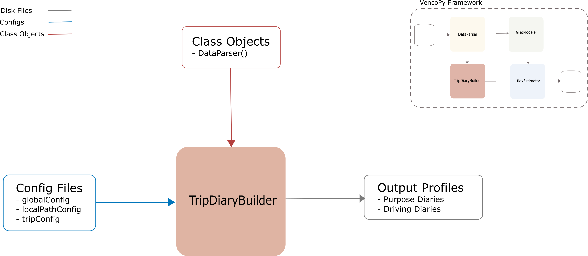

.. venco.py documentation source file, created for sphinx

.. _diarybuilder:

TripDiaryBuilder Class
===================================

TripDiaryBuilder Input
---------------------------------------------------
**Config File (tripConfig.yaml):** currently empty.

**venco.py Classes:**

 * DataParser class output

TripDiaryBuilder Output
---------------------------------------------------
**Output Functions:**

 * vpDiary = TripDiaryBuilder(configs=configs, ParseData=vpData, dataset=dataset, debug=True)

**Disk Files:**

 * Hourly boolean dataset with parking and driving time fo all vehicles (.csv)
 * Hourly purpose dataset for all vehicles (.csv)
