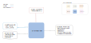

.. venco.py documentation source file, created for sphinx

.. _diarybuilders:

DiaryBuilders Level
===================================

DiaryBuilders Input
---------------------------------------------------
**Config File (user_config.yaml):**

* time_resolution: <value> - User-specific time resolution in minutes
* is_week_diary: bool - Determine if the activity data set comprises weekly activity chains (synthesized by WeekDiaryBuilder)

**venco.py Classes:**

 * FlexEstimator class output

DiaryBuilders Output
---------------------------------------------------
**Output Functions:**

 * diary = DiaryBuilder(configs=configs, activities=flex.activities)
 * diary.create_diaries()

**Disk Files:**

 * Electric battery drain (.csv) `drain`
 * Available charging power (.csv) `charging_power`
 * Uncontrolled charging profile (.csv) `uncontrolled_charging`
 * Maximum battery energy level (.csv) `max_battery_level`
 * Minimum battery energy level (.csv) `min_battery_level`

DiaryBuilders Structure
---------------------------------------------------

DiaryBuilder Class
#################################################################

TimeDiscretiser Class
#################################################################
The discretisation approach implemented in venco.py varies according to the
considered profile. Below the different approaches are presented:

- Profile for uncontrolled charging `uncontrolled_charging`: (function
  :py:meth:`diarybuilders.TimeDiscretiser.__value_non_linear_charge`)
- Profile for the electric demand `drain`: (function
  :py:meth:`diarybuilders.TimeDiscretiser.__value_distribute`)
- Profile for the charging capacity of the fleet `charging_power`: (function
  :py:meth:`diarybuilders.TimeDiscretiser.__value_select`)
- Maximum and minimum battery level profile `max_battery_level` and
  `min_battery_level`: (function
  :py:meth:`diarybuilders.TimeDiscretiser.__value_non_linear_level`)