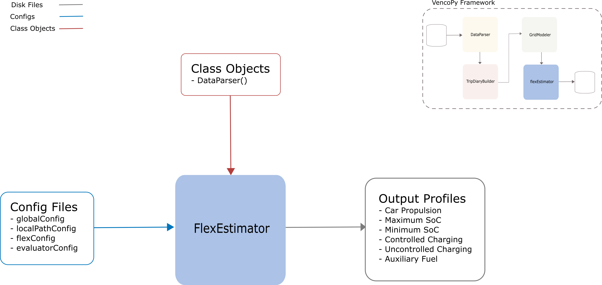

.. VencoPy documentation source file, created for sphinx

.. _flexEstimator:

FlexEstimator Class
===================================

FlexEstimator Input
---------------------------------------------------
**Config File (flexConfig.yaml):**

* inputDataScalars (technical assumption related to the vehicles, e.g. battery size, specfic consumption,..)

**VencoPy Classes:**

* DataParser class output

FlexEstimator Output
---------------------------------------------------
**Output Functions:**

* vpFlex = FlexEstimator(configDict=configDict, datasetID=datasetID, ParseData=vpData)
* vpFlex.baseProfileCalculation()
* vpFlex.filter()
* vpFlex.aggregate()
* vpFlex.correct()
* vpFlex.normalize()
* vpFlex.writeOut()

**Disk Files:**

* Profile for connection capacity of the fleet `plugProfile`
* Profile for uncontrolled charging `chargeProfileUncontrolled`
* Profile for electric demand `electricPowerProfile`
* Profile for additional fuel consumption `driveProfileFuelAux`
* Minimum state-of-charge (SoC) battery profile `socMin`
* Maximum state-of-charge (SoC) battery profile `socMax`
 

Output Profiles
---------------------------------------------------

Below are the specifications of the output modules. This is important, because the output produced holds only
numbers without any units. These specifications describes how these values can be interpreted when VencoPy is configured
correctly. Different steps of filtering, aggregation, correction and normalization are performed for the six profiles.
Thus, it is important to understand what the numbers in the output files refer to. 
VencoPy outputs a total of 6 profiles, 4 flow profiles (demand profiles) and 2 state profiles (energy levels).

*************
Flow Profiles
*************

Profile for connection capacity of the fleet `plugProfile`
############################################################
 
General description
*************************
This profile represents the hourly maximum charging capacity of the electric vehicle fleet. Charging can never be 
higher than this profile but may be lower since not all charging stations run on full capacity or it is attractive for
balancing renewable feed-in to not charge at full capacity. Currently, only one charging capacity per run of VencoPy can
be taken into account. 

**Units:** Profiles are in power units [kW], defined as share of the overall vehicle fleet.

Calculation steps
*************************
1. The profile is calculated based on each plug profile which is a basic input into VencoPy. The input profile is made 
up of boolean values describing if the respective vehicle is connected to the grid (1, Yes, True) or not (0, No, False). 
This hourly boolean profiles are multiplied with the charging capacity e.g. 3.7 kW for a simple home charger. 

We're left with 18000 hourly profiles in kW. Functions: calcChargeProfiles()  in the library `libProfileCalculation.py`.

2. The profiles are filtered according to a specified selector. If 1000 profiles don't fulfill the selection criteria,
we're left with 17000 profiles still in hourly values of kW. Function: `filterConsProfiles()` in the library 
`libProfileCalculation.py`.

3. The filtered individual profiles are then aggregated by a simple averaging of each hourly value to calculate the 
average electricity consumption for one model vehicle for the complete EV fleet. We're left with one profile in hourly values of kW. Function: `aggregateProfiles()` in the library `libProfileCalculation.py`.
profile in hourly values of kW. Function: `aggregateProfilesMean()` in the library `libProfileCalculation.py`.

This profile may later be scaled by the number of vehicles in an EV fleet to calculate the average maximum hourly 
recharge capacity of the EV fleet. 

Profile for uncontrolled charging `chargeProfileUncontrolled`
#################################################################

General description
*************************

For each individual trip and plug profile, one uncontrolled charging profile is calculated. This describes the electric
flow of the grid to the battery under the assumption that the battery is fully charged at beginning of the day. If the 
battery SOC decreases through a trip and the vehicle is connected to the grid, charging occurs with full capacity until
the battery is fully charged. 

**Units:** Profiles can be either in power units [kW] or hourly percentages of the annual demand.

Calculation steps
*************************

1. The profile is calculated based on each maximum charge profile. It is equal to every positive difference between the 
maximum SOC in the current hour minus the SOC in the previous hour. Since the maximum SOC profiles adheres to the 
maximum charging capacity, uncontrolled charging may never overshoot the threshold of the defined maximum charging 
capacity. 

We're left with 18000 profiles in kW. Function: `calcChargeProfilesUncontrolled()` in the library 
`libProfileCalculation.py`.

2. The profiles are filtered according to a specified selector. If 1000 profiles don't fulfill the selection criteria,
we're left with 17000 profiles still in hourly values of kW. Function: `filterConsProfiles()` in the library 
`libProfileCalculation.py`.

3. The filtered individual profiles are then aggregated by a simple averaging of each hourly value to calculate the 
average uncontrolled charging power for one "representative" vehicle for the complete EV fleet. We're left with one 

profile in hourly values of kW. Function: `aggregateProfilesMean()` in the library `libProfileCalculation.py`.

4. The aggregated profile is then corrected according to more realistic specific electric consumption measurements. 
Function: `correctProfiles()` in the library `libProfileCalculation.py`.

This profile may later be scaled by the number of vehicles in an EV fleet to calculate the fleet uncontrolled 
charging electric flow. 

Profile for electric demand `electricPowerProfile`
#################################################################

General description
*************************

Each trip profile implies a specific electricity consumption that represents the time-specific electricity-outflow from
the battery to the electric motor for the purpose of propulsion of the vehicle. In the calculation of the electric 
consumption profile, a potential additional fuel demand for longer trips than feasible with the assumed battery capacity
is subtracted to result in the purely electric consumption.

**Units:** Profiles can be either in power units [kW] or hourly percentages of the annual demand.

Calculation steps
*************************

1. The profile is calculated based on each drive profile which is a basic input into VencoPy. The individual drive 
profiles are scaled with the electric consumption given in the technical vehicle characteristics. If the battery 
capacity doesn't suffice for the trip distance, additional fuel demand is subtracted to only account for electricity
consumption. 

We're left with 18000 hourly profiles in kW. Functions: `calcDrainProfiles()` and `calcElectricPowerProfiles()` in the library `libProfileCalculation.py`.

2. The profiles are filtered according to a specified selector. If 1000 profiles don't fulfill the selection criteria,
we're left with 17000 profiles still in hourly values of kW. Function: `filterConsProfiles()` in the library 
`libProfileCalculation.py`.

3. The filtered individual profiles are then aggregated by a simple averaging of each hourly value to calculate the 
average electricity consumption for one model vehicle for the complete EV fleet. We're left with one
profile in hourly values of kW. Function: `aggregateProfilesMean()` in the library `libProfileCalculation.py`.

4. The aggregated profile is then corrected according to more realistic specific electric consumption measurements. 
Function: `correctProfiles()` in the library `libProfileCalculation.py`.
This profile may later be scaled by the number of vehicles in an EV fleet to calculate the average electric flow leaving 
the EV fleet battery. 

Profile for additional fuel consumption `driveProfileFuelAux`
#################################################################

General description
*************************

This profile gives hourly values for fuel consumption in case a trip and plug profile cannot be supplied only from the 
vehicle battery. This profile is given in units of l of the specified fuel. 

**Units:** Profiles are in [unit].

Calculation steps
*************************

1. The profile is calculated based on the drive profile (basic input), the uncontrolled charging profile, the maximum 
SOC profile and vehicle specifications. It describes fuel consumption for the most optimistic case of uncontrolled 
charging and a fully charged battery at the beginning of the day. It is equal to the electric consumption for driving
minus the electric flow from the battery minus uncontrolled charging. Since all of these profiles are in units of kW, 
the resulting energy needs are then transferred from kWh to l of fuel. 

We're left with 18000 hourly profiles in l. 
Functions: `calcDriveProfilesFuelAux()` in the library `libProfileCalculation.py`.

2. The profiles are filtered according to a specified selector. If 1000 profiles don't fulfill the selection criteria,
we're left with 17000 profiles still in hourly values of l fuel. Function: `filterConsProfiles()` in the library 
`libProfileCalculation.py`.

3. The filtered individual profiles are then aggregated by a simple averaging of each hourly value to calculate the 
average fuel consumption for one model vehicle for the complete EV fleet. We're left with one profile in hourly values
of l fuel. Function: `aggregateProfilesMean()` in the library `libProfileCalculation.py`.

4. The aggregated profile is then corrected according to more realistic specific fuel consumption measurements. 
Function: `correctProfiles()` in the library `libProfileCalculation.py`.

This profile may later be scaled by the number of vehicles in an EV fleet to calculate the average fuel consumption 
needed by the hybrid electric vehicle fleet. 

**************
State Profiles
**************

Maximum state-of-charge profile `socMax`
#################################################################
Time series containing the maximum energy level of the vehicle batteries. 

**Units:** Profiles can be either in energy units [kWh] or relative to the battery capacity.

Minimum state-of-charge profile `socMin`
#################################################################
Time series containing the minimum energy level of the vehicle batteries. 

**Units:** Profiles can be either in energy units [kWh] or relative to the battery capacity.

Filtering Functionalities in FlexEstimator
---------------------------------------------------

In the following, filtering procedures in VencoPy for individual profiles are documented. Filtering occurs after
the completion of the main calculation steps using selectors. These are calculated based only on the four flow-related 
profiles (consumption, plugPower, uncontrolledCharge and auxilliaryFuelConsumption) in `calcProfileSelectors()` and 
applied to both flow-profiles and state-profiles. 

Four criteria are applied to select individual profiles that are eligible for load shifting.

1.  Profiles that depend on auxilliary fuel are excluded. These are profiles where consumption is higher than available
    battery SOC for at least one hour. This can also occur when vehicles drive only short distances but don't connect
    to the grid sufficiently.
    
2.  A minimum daily mileage in km can be set in the non-profile data (per default VencoPy_scalarInput.xlsx) to filter 
    out profiles where the mileage is below a specified threshold. In the shipped file, this value is set to 0. 

3.  In case a fully charged battery does not suffice for the daily mileage of the respective profile, this profiles is
    excluded.

4.  Available charging throughout the day doesn't supply sufficient energy for the driven distance. This may occur even
    though the profile is eligible from criteria 3 e.g. when connection is never possible. 

