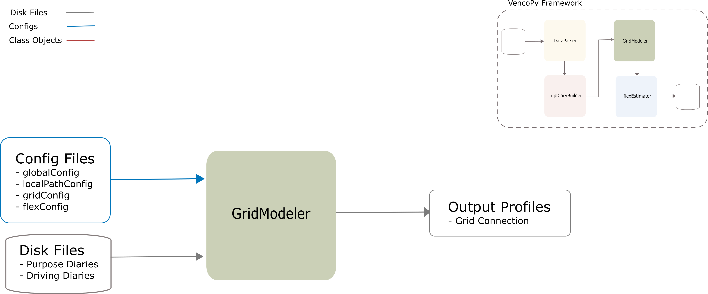

.. VencoPy documentation source file, created for sphinx

.. _gridModeler:

GridModeler Class
===================================

GridModeler Input
---------------------------------------------------
**Config File (gridConfig.yaml):**

* chargingInfrastructureMappings (assigns True-False to the respective type of charging infrastucture)

GridModeler Output
---------------------------------------------------
**Output Functions:**

* vpGrid = GridModeler(configs=configs, dataset=dataset)
* vpGrid.assignSimpleGridViaPurposes()
* vpGrid.writeOutGridAvailability()

**Disk File:**

* Hourly boolean dataset with plugging time fo all vehicles (.csv)

