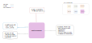

.. venco.py documentation source file, created for sphinx

.. _postprocessor:

PostProcessor Class
===================================

PostProcessor Input
---------------------------------------------------
**Config File (user_config.yaml):**

* start_weekday: 1 - Number corresponding to start day of the week for annual profile (1=Monday)

**venco.py Classes:**

 * ProfileAggregator class output (5 profiles)

PostProcessor Output
---------------------------------------------------
**Output Functions:**

 * post = PostProcessor(configs=configs, profiles=profile)
 * post.create_annual_profiles()
 * post.normalise()

**Disk Files:**

 * Electric battery drain (.csv)
 * Available charging power (.csv)
 * Uncontrolled charging profile (.csv)
 * Maximum battery energy level (.csv)
 * Minimum battery energy level (.csv)

Timeseries Creation and Normalisation
---------------------------------------------------

Weekly or annual timeseries and normalisation.