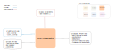

.. venco.py documentation source file, created for sphinx

.. _profileaggregator:

ProfileAggregator Class
===================================

TripDiaryBuilder Input
---------------------------------------------------
**Config File (user_config.yaml):**

* aggregation_timespan: weekly - Options are: daily, weekly
* weight_flow_profiles: bool - Currently only used for flow profile aggregation
* alpha: 10 - Percentile to exclude for state profiles aggregation

**venco.py Classes:**

 * DiaryBuilder class output (5 profiles)

TripDiaryBuilder Output
---------------------------------------------------
**Output Functions:**

 * vpProfile = ProfileAggregator(configs=configs, activities=vpDiary.activities, profiles=vpDiary)
 * vpProfile.aggregate_profiles()

**Disk Files:**

 * Electric battery drain (.csv)
 * Available charging power (.csv)
 * Uncontrolled charging profile (.csv)
 * Maximum SoC (.csv)
 * Minimum SoC (.csv)
